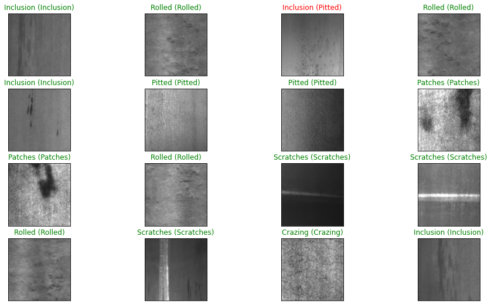

# Metal-Surface-Defect-Inspection
It's a deep learning project used to classify metal surface defects. Images were collected for this project from the NEU database containing six defect types. Below is the result, where the first name is the prediction from the model, and the second name is in the bracket true category of respective images. You can download the data set from here: https://www.kaggle.com/fantacher/neu-metal-surface-defects-data. 

This dataset contains a single folder with 1800 data. If you want to implement this project the way I did, you first need to separate these datasets into six folders with 300 images of each. Then you are done; just run the Notebook into your data directory, and you will get the same results. Please also improve the model by integrating it with any transfer learning model.

If you feel like citing this work in a research article, you can cite from [Google Scholar](https://scholar.google.com/citations?view_op=view_citation&hl=en&user=7WrB3AcAAAAJ&citation_for_view=7WrB3AcAAAAJ:WF5omc3nYNoC).

